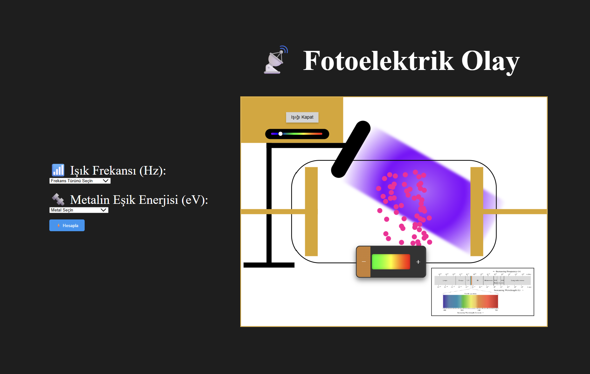
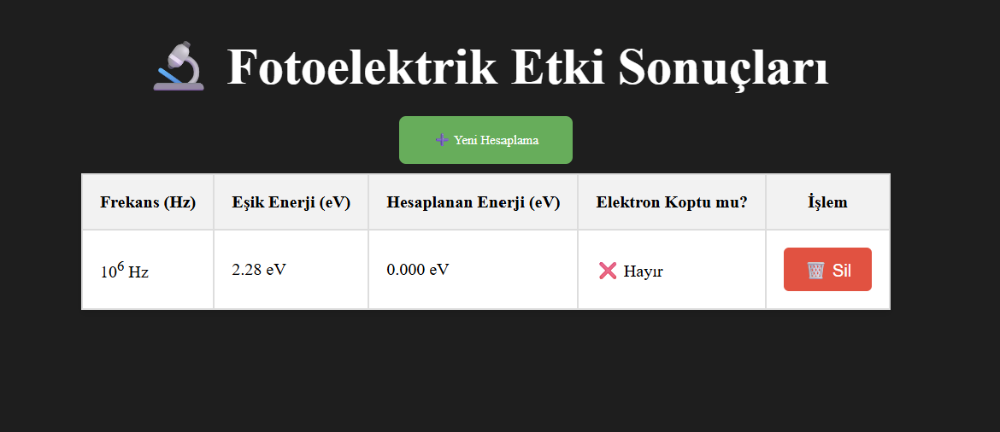

# 🔬 Fotoelektrik Etki Simülasyonu

Bu proje, **Ruby on Rails** ile geliştirilmiş bir fotoelektrik etki simülasyonudur.  
Kullanıcı, ışık frekansı ve metalin eşik enerjisi parametresini girerek:

- Fotoelektrik olayın gerçekleşip gerçekleşmeyeceğini
- Kopan elektronların kinetik enerjisini
- Sonuçların tablo görselleştirilmesini
hesaplayabilir.

## 📐 Fiziksel Model

Einstein’ın fotoelektrik denklemi kullanılmıştır:

E_k = h * f - φ

Burada:
- `E_k` → Elektronun kinetik enerjisi  
- `h` → Planck sabiti  
- `f` → Işığın frekansı  
- `φ` → Metalin iş fonksiyonu (eşik enerjisi)  

Eğer `h * f > φ` ise fotoelektrik olay gerçekleşir.

## 🛠 Kullanılan Teknolojiler
- Ruby on Rails (MVC yapısı)
- HTML & CSS ile özel arayüz
- Js ile simülasyon oluşumu
- Rails helper metodları (`link_to`, `number_with_precision` vb.)
- RESTful route yapısı

## 📸 Ekran Görüntüleri
Proje arayüzünden örnekler:

